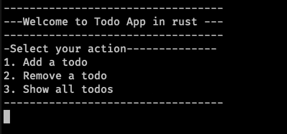

# Todo app with rust

This is a naive and simple todo app.

## Why?
I created this project to learn the basics of rust and gather feedback from
people with more experience.

## Coding details
To define the entities of the app, I created 2 structures.

- `Todo`: Encapsulates the properties of a todo (id, title and description).
- `TodoStore`: Encapsulates the property `todos` which is a vector that stores the todos.
Also, it implements 3 functions, `add_todo`, `remove_todo`, `show_all_todos`.

In the `main()` function, I instantiated the `TodoStore` struct and created a loop
which inside prints the menu on the console, which lets the user select one option through `stdin`
when the user selects the option, the option will be evaluated by a `match` statement and execute
the desired action which can be any of the implemented functions of the `TodoStore` struct.

## Example

